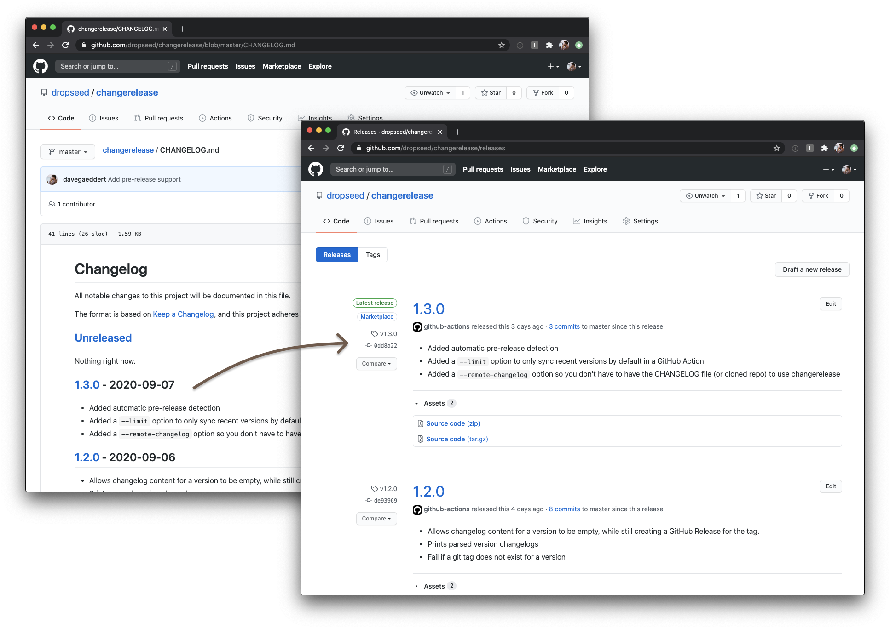

# changerelease

Automatically update your GitHub Releases from `CHANGELOG.md`.

This tool expects that you follow the [Keep a Changelog](https://keepachangelog.com/) format.

To use it:

1. [Keep a Changelog](https://keepachangelog.com/)
1. Git tag your versions
1. Let the changerelease GitHub Action automatically keep your GitHub Releases updated



## Use the GitHub Action

```yml
name: changerelease
on:
  workflow_dispatch: {}
  push:
    paths: [CHANGELOG.md]
    branches: [master]
    tags: ["*"]

jobs:
  sync:
    runs-on: ubuntu-latest
    steps:
    - uses: dropseed/changerelease@v1
      with:
        github_token: ${{ secrets.GITHUB_TOKEN }}
        # optional
        tag_prefix: v
        changelog: CHANGELOG.md
```

## Use the Python package

```sh
$ pip install changerelease
$ changerelease sync --repo org/repo --token TOKEN
```
